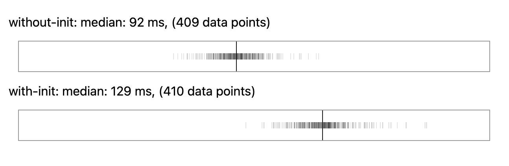
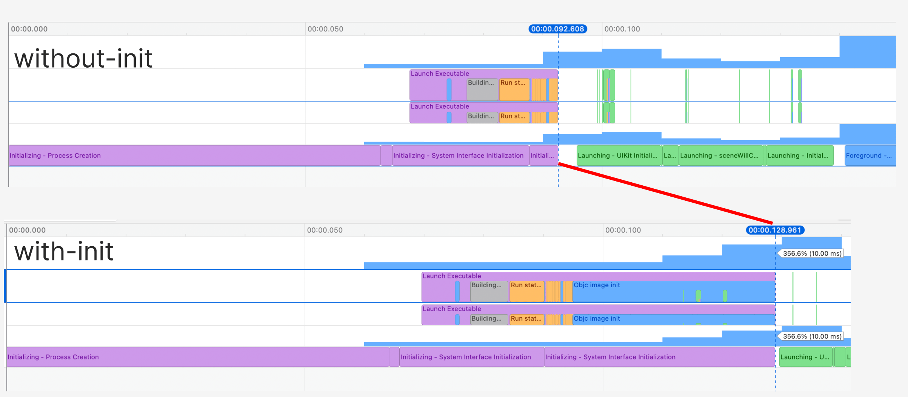

# 2024-07-ios-iterate-all-objc-classes-perf

This repo is for a reproducible benchmark for https://github.com/ikhvorost/ReactBridge/issues/10 also for my learning on "how to create a good benchmarking script for reproducibility".

Basically it measures the duration for [this function](https://github.com/ikhvorost/ReactBridge/blob/93e0318d87cd3f9438ca10120a50e86afab1af65/Sources/ReactBridgeUtils/ReactBridgeUtils.m#L40-L63), where it iterates all the Objective-C classes and methods with dynamic memory allocations. It's using an app generated from "Create New Project" in Xcode with [./DemoApp/DemoApp/ExecuteSomethingBeforeMain.m](./DemoApp/DemoApp/ExecuteSomethingBeforeMain.m).

It turned out this has non trivial performance impact on the app start up time.

## Benchmark result in my environment

I used my personal iPhone 13 mini (iOS 17.5.1) for the benchmark and the result was the following.

Note that "with-init" variant is the one with heavy code to iterate through Objective-C classes in [./DemoApp/DemoApp/ExecuteSomethingBeforeMain.m](./DemoApp/DemoApp/ExecuteSomethingBeforeMain.m).
The benchmark script ran (cold) app start up sequence several times and the following distribution shows the duration of "from the app start to static initialization finished":



Looking at the traces around medians for each variant, we see a huge block of "ObjC Image init" in "with-init" variant:



So for my case, the static initialization duration **increased around 40%** by iterating through all the Objective-C classes, which is significant slowdown. And this is for the minimal app. I think the slowdown might be non-linear for the app complexity increase.

For the record, in my case, when I enable logging in [./DemoApp/DemoApp/ExecuteSomethingBeforeMain.m](./DemoApp/DemoApp/ExecuteSomethingBeforeMain.m), the output was the following:

```
numClasses: 37245
loopCount: 56065
```

We have many Objective-C classes and methods even for the newly created "hello world" app!

## How to run the benchmark

## Prerequisite

- You should have Xcode (I tested on Xcode 15.3) on your macOS
- Please use Node.js (at least v22, I used v22.4.1) and make sure to run `corepack enable` for the first time.

Then please run the following:

```
pnpm install
```

## Build the app for two variants

The following will build the apps for two variants.
One variant is called "without-init" and the other is called "with-init".
The former does not run anything in [./DemoApp/DemoApp/ExecuteSomethingBeforeMain.m](./DemoApp/DemoApp/ExecuteSomethingBeforeMain.m) and the latter runs a set of heavy operations which involves iterating through all the Objective-C classes.

```
pnpm exec tsx ./scripts/00000-build.ts
```

## Run the benchmark

The following will run the benchmark. xctrace files will be stored under the "traces" directory.

```
BENCHMARK_TARGET_IOS_DEVICE_UDID=YOUR_DEVICE_UDID_HERE pnpm exec tsx ./scripts/00100-run-benchmark.ts
```

## Convert collected xctrace files in the benchmark into JSON

```
pnpm exec tsx ./scripts/00200-dump-data.ts
```

## View the benchmark result in the web UI

```
pnpm run ui
```
